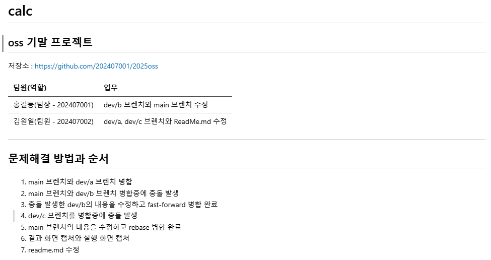

# 💻 calc – OSS 기반 프로젝트

## 📁 저장소
(https://github.com/202407038/2025oss)

## 👥 팀원 구성

| 이름       | 역할                            |
|------------|----------------------------------|
| 김규환 202407038 | 팀장 – dev/a 및 main 브랜치 수정 |
| 박승연 202407049 | 팀원 – dev/b |
| 송승규 202407047 | 팀원 – dev/c (닉네임과 학번이 일치하지 않음 = susuji5140) |

## 📌 프로젝트 개요

본 프로젝트는 사칙연산 기능을 제공하는 콘솔 계산기를 개발하며, Git을 활용한 협업 및 충돌 해결 과정을 실습하기 위한 OSS 기반 팀 프로젝트입니다.

## 🔧 개발 브랜치 및 병합 과정

### 문제 해결 순서

1. `main` 브랜치와 `dev/a` 브랜치 병합 시 `calc.cpp`, `add.cpp`, `sub.cpp` 에서 충돌 발생
2. 각 브렌치 수정 내용에 맞게 수정 후 fast-forward 병합 완료
3. `main` 브랜치와 `dev/b` 병합 시 `calc/mul.h`에서 충돌 발생
4. `dev/b`의 내용을 수정하고 fast-forward 병합 완료
5. `dev/c` 브랜치 병합 시 충돌 발생
6. `dev/c`의 내용을 수정하고 fast-forward 병합 완료
7. 정상 병합 확인 및 프로그램 실행
8. `README.md` 최종 수정

